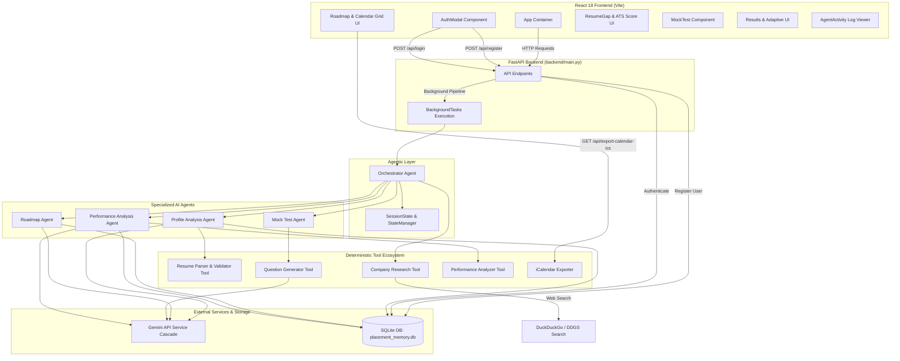

# IOC Placement — Agentic AI Placement Preparation System

**IOC Placement** is an enterprise-grade Agentic AI platform designed to automate, personalize, and optimize campus placement preparation. The system constructs individual preparation workflows based on candidate profile inputs, extracted resume data, target company benchmarks, target job roles, available preparation timeframes, and historical performance metrics.

By integrating multi-agent orchestration, LLM reasoning (via Google Gemini API), deterministic Python tools, live company research, automated resume parsing, persistent SQLite memory, and an adaptive feedback loop, the platform provides end-to-end placement readiness evaluation and day-by-day study scheduling.

---

## Project Overview

Traditional placement preparation platforms operate passively: students are presented with static roadmaps, pre-fabricated generic question banks, and uncoordinated chatbots. These approaches fail to account for candidate resume content, specific target role requirements, or historical performance across preparation sessions.

This project implements an **autonomous closed-loop multi-agent architecture**. When a candidate registers or initiates a session, an Orchestrator Agent coordinates a pipeline of specialized AI agents and deterministic tools:

```
Candidate Input & Resume Upload
              │
              ▼
    FastAPI Web Backend
              │
              ▼
      Orchestrator Agent
              │
  ┌───────────┴───────────┐
  ▼                       ▼
New Registration        User Login
  │                       │
  ▼                       ▼
Agent Execution Pipeline  Load Saved Memory
  ├─ Profile Analysis       (SQLite Database)
  ├─ Resume Validation            │
  ├─ Company Research             ▼
  ├─ Skill Gap Analysis   Direct Roadmap Access
  ├─ Roadmap Generation
  └─ MCQ Generation
              │
              ▼
    Mock Test Assessment
              │
              ▼
   Performance Analyzer
              │
              ▼
     Adaptive Schedule Loop
              │
              ▼
Persistent Cross-Session Memory
```

The system is **not** a simple frontend wrapper around an LLM endpoint. It delegates specialized tasks to specialized components:
- **LLM Reasoning**: Used where unstructured language understanding or creative synthesis is required (parsing complex requirements, generating structured MCQs, computing ATS feedback).
- **Deterministic Python Operations**: Used where mathematical precision or strict verification is required (parsing PDF text, evaluating test score percentages, calculating topic accuracy, managing database records, generating `.ics` iCalendar exports).

---

## Problem Statement

Campus placement preparation presents several structural challenges for candidates:

1. **Generic Preparation Plans**: Preparation schedules are rarely customized to a student's existing skill level, available daily hours, or prep timeframe.
2. **Superficial Resume Consideration**: Traditional systems ignore the candidate's actual resume text, leading to redundant study of topics the student has already mastered.
3. **Evolving Target Company Requirements**: Company interview patterns and skill priorities vary significantly across organizations (e.g., Google vs. startup roles).
4. **Unidentified Skill Gaps**: Candidates lack objective visibility into gaps between their current resume profile and target role benchmarks.
5. **Lack of Continuous Learning History**: Most test platforms evaluate sessions in isolation, failing to track repeated weaknesses across multiple attempts.
6. **Static, Non-Adaptive Roadmaps**: Study schedules do not adjust when a student scores poorly on specific technical topics during practice tests.

### How IOC Placement Resolves These Challenges

- **Personalized Candidate Profiling**: Synthesizes self-reported skills with parsed resume data to identify exact candidate competencies.
- **ATS Resume Match Scoring**: Evaluates candidate resumes against target role criteria, outputting a 0–100% compatibility score and specific resume layout/bullet-point improvements.
- **Live & Curated Market Research**: Gathers hiring criteria, technical stack requirements, official career application URLs, and verified technical study links (LeetCode, GeeksforGeeks, MDN, System Design Primer).
- **Dynamic Day-by-Day Scheduling**: Constructs custom preparation schedules matching exact candidate timeframes ($1$ to $90$ days) and daily study hours.
- **Dynamic Placement Assessment**: Constructs $50$–$60$ question technical mock assessments dynamically generated for the candidate's target role.
- **Closed-Loop Adaptive Learning**: Automatically modifies upcoming study schedules following test submissions, elevating weak topic priorities (`High` priority, `[REINFORCED]` tags, extra time slots).
- **Persistent Cross-Session Memory**: Stores candidate performance in an embedded SQLite database (`placement_memory.db`), allowing returning users to load saved roadmaps instantly and carrying weak topics into future preparation sessions.

---

## System Architecture

The architecture separates concerns into a React Vite frontend, a FastAPI HTTP API, an Agentic Orchestrator, specialized AI agents, deterministic Python tools, a centralized Gemini API client service, and an embedded SQLite memory layer.



---

## Detailed Agent Workflow & Specification

### 1. Orchestrator Agent (`backend/agents/orchestrator.py`)

- **Role**: Coordinates overall pipeline execution, state initialization, state transitions, timing, terminal logging, and test submission processing.
- **Inputs**: `StudentInput`, resume file path (optional), `session_id`, `QuizSubmission`.
- **Processing**:
  1. Creates or retrieves `SessionState` via `StateManager`.
  2. Executes state transitions: `INIT ➔ PROFILE_ANALYSIS ➔ COMPANY_RESEARCH ➔ ROADMAP_GENERATION ➔ MOCK_TEST_GENERATION ➔ COMPLETED`.
  3. Formats colorized terminal section banners and calculates execution durations.
  4. On test submission: triggers `PerformanceAnalysisAgent`, applies adaptive schedule updates, and logs state transitions (`SUBMITTED ➔ PERFORMANCE_EVALUATION ➔ ADAPTIVE_LEARNING ➔ COMPLETED`).
- **Outputs**: Active `session_id`, updated `SessionState`, evaluation results (`PerformanceReport`, `AdaptiveAdjustment`).

### 2. Profile Analysis Agent (`backend/agents/profile_agent.py`)

- **Role**: Evaluates student capability, extracts resume skills, queries persistent memory for past weak topics, calculates ATS compatibility score ($0$–$100\%$), and identifies skill gaps.
- **Inputs**: `StudentInput`, `ResumeData` (optional), SQLite memory history.
- **Processing**:
  1. Queries SQLite memory (`MemoryManager.get_student_history`) for historical weak topics.
  2. Combines self-reported skills with extracted resume skills.
  3. Constructs a structured JSON prompt for Gemini API requesting ATS match score, matched/missing skills, formatting feedback, and actionable resume fixes.
  4. Merges historical unmastered topics into current weak areas.
  5. Saves updated student profile to SQLite database (`student_profiles` table).
- **Outputs**: `StudentProfile` schema containing `ats_resume_score` and `resume_score_details`.

### 3. Roadmap Agent (`backend/agents/roadmap_agent.py`)

- **Role**: Generates a day-by-day study schedule matching candidate preparation days ($1$–$90$ days) and daily study hours ($1.0$–$16.0$ hrs/day).
- **Inputs**: `StudentProfile`, `CompanyResearch`, SQLite memory history.
- **Processing**:
  1. Checks memory history for past unmastered topics.
  2. Enforces allocation constraints: exact day count, balanced daily hours, high priority for weak topics.
  3. Queries Gemini API to construct structured JSON roadmap days and tasks.
  4. Applies `[REINFORCED]` tags and `High` priority to tasks addressing historical weak topics.
  5. Saves generated roadmap to SQLite database (`roadmaps` table).
- **Outputs**: `Roadmap` schema containing an overview string and array of `RoadmapDay` objects.

### 4. Mock Test Agent (`backend/agents/mock_test_agent.py`)

- **Role**: Coordinates the generation of a $50$–$60$ question dynamic technical assessment tailored to candidate target role and roadmap topics.
- **Inputs**: `session_id`, `StudentProfile`, `CompanyResearch`, `Roadmap`, `question_count` (default: 55).
- **Processing**:
  1. Queries memory history for past weak topics to ensure proper representation in question selection.
  2. Delegates question creation to `QuestionGeneratorTool`.
  3. Constructs `MockTest` object containing target question count and question array.
- **Outputs**: `MockTest` schema object.

### 5. Performance Analysis Agent (`backend/agents/performance_agent.py`)

- **Role**: Evaluates candidate quiz submissions, calculates deterministic metrics, saves attempt details to memory, and adaptively updates upcoming roadmap days.
- **Inputs**: `MockTest`, `QuizSubmission`, active `Roadmap`.
- **Processing**:
  1. Invokes `PerformanceAnalyzerTool` for deterministic mathematical grading.
  2. Computes score trend compared to candidate's previous attempt in SQLite DB.
  3. Saves mock test attempt to SQLite database (`mock_attempts` table).
  4. Queries Gemini API for specific remediation concepts, practice tasks, and next-day schedule changes.
  5. Iterates through upcoming roadmap days, bumping weak topic tasks to `High` priority, applying `[REINFORCED]` prefixes, and scaling duration hours by $1.3\times$.
  6. Saves adaptive adjustment record to SQLite database (`adaptive_adjustments` table).
- **Outputs**: Tuple of (`PerformanceReport`, `AdaptiveAdjustment`).

---

## Specialized Tool Ecosystem

### 1. Resume Parser & Validator Tool (`backend/tools/resume_parser.py`)

- **Validation Method**: `validate_resume(file_path, candidate_name)`
  - Verifies file format (`.pdf`, `.docx`, `.doc`).
  - Asserts extracted text length $\ge 100$ characters.
  - Splits candidate name into tokens ($\ge 3$ chars) and checks if at least one name token exists in extracted resume text.
  - Returns structured `ResumeValidationResult` with explicit error messages.
- **Parsing Method**: `parse_file(file_path)`
  - Reads PDF files using PyMuPDF (`fitz`) or Word files using `python-docx`.
  - Extracts text, categorizes technical skills, programming languages, frameworks, databases, projects, and work experience into a `ResumeData` object.

### 2. Company Research Tool (`backend/tools/company_research.py`)

- **Execution Method**: `research_company_and_role(company_name, role_name)`
  - Executes live web search via DuckDuckGo (`ddgs` / `duckduckgo_search`).
  - Gathers job role descriptions, key skill requirements, and hiring process details.
  - Appends official company career application URLs (e.g. `https://careers.google.com` for Google) and verified technical study resources (LeetCode, GeeksforGeeks, MDN Web Docs, System Design Primer, Roadmaps.sh).
  - Falls back gracefully to role-based industry benchmarks if web search is unavailable (`research_available = False`).

### 3. Question Generator Tool (`backend/tools/question_generator.py`)

- **Execution Method**: `generate_mock_test_questions(profile, company_research, roadmap, target_count)`
  - Queries Gemini API in structured parallel batches:
    - Batch 1: Core CS Concepts (DSA, DBMS, OOP, OS, Networking).
    - Batch 2: Target Role & System Design Specific Questions.
  - Enforces 4 distinct options per question and validates that `correct_answer` strictly matches one of the 4 option strings.
  - Deduplicates questions using lowercase text hashing.
  - Synthesizes dynamic domain questions if API batch returns fewer than target count.

### 4. Performance Analyzer Tool (`backend/tools/performance_analyzer.py`)

- **Execution Method**: `analyze_submission(test, submission)`
  - Pure Python deterministic evaluation engine (zero LLM dependency for grading).
  - Maps submitted answer strings against question answer keys.
  - Computes total questions, answered count, correct count, incorrect count, and exact score percentage (`round((correct / total) * 100, 1)`).
  - Calculates topic-wise accuracy percentages and difficulty accuracy breakdowns (`easy`, `medium`, `hard`).
  - Categorizes topics into `strong_topics` ($\ge 70\%$ accuracy) and `weak_topics` ($\le 50\%$ accuracy).

### 5. iCalendar Exporter (`backend/utils/ics_exporter.py`)

- **Execution Method**: `generate_ics_content(roadmap, candidate_name)`
  - Generates standard RFC 5545 iCalendar content mapping roadmap days to consecutive dates starting from today.
  - Formats `BEGIN:VCALENDAR`, `BEGIN:VEVENT`, event summaries, descriptions, and time bounds (`DTSTART` / `DTEND`).

---

## LLM vs. Deterministic Task Decomposition

| Task / Feature | Implementation Type | Responsible Module | Rationale |
| :--- | :--- | :--- | :--- |
| **Candidate Name & Resume Validation** | Deterministic Python | `resume_parser.py` | String token matching & character counting require absolute accuracy. |
| **Resume Text & Skill Extraction** | Deterministic Python | `resume_parser.py` | PyMuPDF / python-docx extraction provides fast, reliable text parsing. |
| **ATS Score & Gap Analysis** | LLM Reasoning | `profile_agent.py` | Requires language understanding to evaluate resume phrasing against job roles. |
| **Company Hiring Research** | Deterministic Web Scraping | `company_research.py` | DuckDuckGo web search retrieves real-time application URLs and sources. |
| **Study Roadmap Schedule Generation** | LLM Reasoning | `roadmap_agent.py` | Requires dynamic synthesis of custom daily tasks matched to time constraints. |
| **MCQ Question Generation** | LLM Reasoning | `question_generator.py` | Creates diverse, non-prewritten technical questions for targeted roles. |
| **MCQ Option & Correct Answer Verification** | Deterministic Python | `question_generator.py` | Guarantees exactly 4 distinct options and valid answer key matching. |
| **Test Scoring & Accuracy Calculation** | Deterministic Python | `performance_analyzer.py` | Grading math must be $100\%$ accurate without LLM math hallucinations. |
| **Progress Trend Comparison** | Deterministic Python | `performance_agent.py` | Compares current percentage score against historical SQLite test records. |
| **Roadmap Schedule Reinforcement** | Deterministic Python | `performance_agent.py` | Applies $1.3\times$ time scaling, `High` priority, and `[REINFORCED]` tags to weak topics. |
| **Database Storage & Authentication** | Deterministic Python | `memory_manager.py` | SQLite queries and SHA-256 password hashing. |
| **iCalendar (.ics) File Generation** | Deterministic Python | `ics_exporter.py` | RFC 5545 calendar string formatting. |

---

## State Management & Workflow Orchestration

Session state is encapsulated in `SessionState` (`backend/models/state.py`) and managed globally by `StateManager`:

```python
class SessionState:
    def __init__(self, session_id: str):
        self.session_id: str = session_id
        self.student_input: Optional[StudentInput] = None
        self.resume_data: Optional[ResumeData] = None
        self.profile: Optional[StudentProfile] = None
        self.company_research: Optional[CompanyResearch] = None
        self.roadmap: Optional[Roadmap] = None
        self.mock_test: Optional[MockTest] = None
        self.performance: Optional[PerformanceReport] = None
        self.adaptive_adjustment: Optional[AdaptiveAdjustment] = None
        self.events: List[AgentEvent] = []
```

### State Graph Execution Flow (`backend/workflows/placement_graph.py`)

The workflow defines node functions and state transitions:
1. `INIT ➔ PROFILE_ANALYSIS`: Profile Analysis Agent reads history and generates profile.
2. `PROFILE_ANALYSIS ➔ COMPANY_RESEARCH`: Company Research Tool fetches web criteria.
3. `COMPANY_RESEARCH ➔ ROADMAP_GENERATION`: Roadmap Agent creates day-by-day schedule.
4. `ROADMAP_GENERATION ➔ MOCK_TEST_GENERATION`: Mock Test Agent generates 55 MCQs.
5. `MOCK_TEST_GENERATION ➔ COMPLETED`: Initial preparation pipeline complete.
6. `SUBMITTED ➔ PERFORMANCE_EVALUATION`: Performance Analysis Agent evaluates test submission.
7. `PERFORMANCE_EVALUATION ➔ ADAPTIVE_LEARNING`: Updates upcoming roadmap days.
8. `ADAPTIVE_LEARNING ➔ COMPLETED`: Closed-loop feedback cycle complete.

---

## Persistent Memory Architecture (SQLite)

Application memory is stored in an embedded SQLite database at `backend/memory/placement_memory.db`.

```sql
-- User Accounts
CREATE TABLE IF NOT EXISTS users (
    id INTEGER PRIMARY KEY AUTOINCREMENT,
    username TEXT UNIQUE NOT NULL,
    email TEXT UNIQUE NOT NULL,
    password_hash TEXT NOT NULL,
    name TEXT NOT NULL,
    target_company TEXT,
    target_role TEXT,
    prep_days INTEGER DEFAULT 14,
    daily_hours REAL DEFAULT 4.0,
    current_skills TEXT DEFAULT '',
    created_at TIMESTAMP DEFAULT CURRENT_TIMESTAMP
);

-- Student Profiles
CREATE TABLE IF NOT EXISTS student_profiles (
    id INTEGER PRIMARY KEY AUTOINCREMENT,
    name TEXT UNIQUE NOT NULL,
    target_company TEXT,
    target_role TEXT,
    prep_days INTEGER,
    daily_hours REAL,
    user_skills TEXT,
    strong_areas TEXT,
    weak_areas TEXT,
    resume_gaps TEXT,
    ats_score REAL DEFAULT 75.0,
    resume_score_json TEXT,
    created_at TIMESTAMP DEFAULT CURRENT_TIMESTAMP,
    updated_at TIMESTAMP DEFAULT CURRENT_TIMESTAMP
);

-- Mock Attempts
CREATE TABLE IF NOT EXISTS mock_attempts (
    id INTEGER PRIMARY KEY AUTOINCREMENT,
    session_id TEXT NOT NULL,
    student_name TEXT NOT NULL,
    total_questions INTEGER,
    answered_questions INTEGER,
    correct_count INTEGER,
    incorrect_count INTEGER,
    score_percentage REAL,
    topic_accuracy_json TEXT,
    difficulty_accuracy_json TEXT,
    strong_topics_json TEXT,
    weak_topics_json TEXT,
    created_at TIMESTAMP DEFAULT CURRENT_TIMESTAMP
);

-- Roadmaps
CREATE TABLE IF NOT EXISTS roadmaps (
    id INTEGER PRIMARY KEY AUTOINCREMENT,
    session_id TEXT UNIQUE NOT NULL,
    student_name TEXT NOT NULL,
    total_days INTEGER,
    daily_hours REAL,
    overview TEXT,
    days_json TEXT,
    created_at TIMESTAMP DEFAULT CURRENT_TIMESTAMP
);

-- Adaptive Adjustments
CREATE TABLE IF NOT EXISTS adaptive_adjustments (
    id INTEGER PRIMARY KEY AUTOINCREMENT,
    session_id TEXT NOT NULL,
    student_name TEXT NOT NULL,
    weak_topics_addressed_json TEXT,
    concepts_to_revise_json TEXT,
    schedule_changes_json TEXT,
    created_at TIMESTAMP DEFAULT CURRENT_TIMESTAMP
);
```

### Memory Recall in Practice

When a candidate initiates a session:
1. `MemoryManager.get_student_history(name)` retrieves all prior attempts, profiles, and roadmaps.
2. Identifies topics weak in $>1$ attempt (`repeated_weaknesses`).
3. Passes `past_weak_topics` into `ProfileAnalysisAgent`, `RoadmapAgent`, and `MockTestAgent`.
4. `RoadmapAgent` elevates study priority (`High`), increases daily hours, and adds `[REINFORCED]` tags to those topics.

---

## User Registration vs. Returning Login Workflows

### 1. New Candidate Registration
- Candidate registers via `AuthModal.jsx` popup modal.
- Uploads resume (`.pdf`/`.docx`), inputs target role/company, timeframe, and daily study hours.
- Backend validates resume format, text length, and candidate name match.
- User credentials (SHA-256 hashed password) are saved to `users` table.
- System launches multi-agent preparation pipeline in `BackgroundTasks`.
- **Frontend View**: Automatically opens the **Agent Execution** (`activity`) tab, streaming real-time terminal logs while data is generated.

### 2. Returning Candidate Login
- Candidate signs in with registered username and password.
- Backend authenticates credentials and retrieves saved history from SQLite database.
- **Frontend View**: **Bypasses Agent Execution completely**. Immediately loads saved profile, ATS match score, roadmap schedule, calendar view, and mock test, opening directly on the **Roadmap Schedule** (`roadmap`) tab.

---

## API Documentation

### `POST /api/register`
Registers user account, validates resume, and triggers preparation pipeline in background task.
- **Form Parameters**: `username`, `email`, `password`, `name`, `target_company`, `target_role`, `prep_days`, `daily_hours`, `current_skills`, `resume` (file).
- **Responses**: `200 OK` (success with `session_id` and `user`), `400 Bad Request` (duplicate user/email or resume validation failure).

### `POST /api/login`
Authenticates registered candidate and retrieves saved session history.
- **JSON Payload**: `{"username": "...", "password": "..."}`
- **Responses**: `200 OK` (success with `user`, `history`, `session_id`), `401 Unauthorized` (invalid credentials).

### `POST /api/prepare`
Triggers preparation pipeline for unauthenticated guest sessions in background task.
- **Form Parameters**: `name`, `target_company`, `target_role`, `prep_days`, `daily_hours`, `current_skills`, `resume` (file).
- **Response**: `200 OK` with `session_id`.

### `GET /api/session-status?session_id={id}`
Polls session state progress.
- **Response**: `{"status": "completed", "is_complete": true, "profile": {...}, "company_research": {...}, "roadmap": {...}, "mock_test_ready": true}`

### `GET /api/mock-test?session_id={id}`
Returns generated 50–60 question mock assessment.
- **Response**: `{"status": "success", "mock_test": {"session_id": "...", "total_questions": 55, "questions": [...]}}`

### `POST /api/submit-test`
Evaluates quiz submission and applies adaptive learning updates.
- **JSON Payload**: `{"session_id": "...", "answers": [{"question_index": 0, "selected_option": "..."}]}`
- **Response**: `{"status": "success", "performance": {...}, "adaptive_adjustment": {...}}`

### `GET /api/export-calendar-ics?session_id={id}`
Exports current session roadmap as an `.ics` iCalendar file (`text/calendar`).

### `GET /api/agent-events?session_id={id}`
Returns real-time execution event logs for frontend streaming.

---

## Frontend Architecture

The frontend is built with **React 18** and **Vite**, using Vanilla CSS for glassmorphism styling:

- **`App.jsx`**: Core UI container managing active tabs (`activity`, `roadmap`, `gaps`, `test`, `results`, `sources`), polling session status, and controlling user authentication state.
- **`AuthModal.jsx`**: Popup modal for candidate Login and Registration with inline validation alert banners.
- **`AgentActivity.jsx`**: Real-time terminal log viewer streaming agent steps, state transitions, and tool timings.
- **`Roadmap.jsx`**: Interactive study schedule featuring a **Calendar View Grid** (Day 1 expanded by default, other days collapsible into cards) and **Timeline View**, progress bar, and **"Download iCal (.ics)"** button.
- **`ResumeGap.jsx`**: **ATS Resume Score & Fixes** tab displaying the $0$–$100\%$ score ring gauge, matched/missing technical skills, and actionable resume formatting suggestions.
- **`MockTest.jsx`**: Timed technical assessment interface with question navigator grid and option selection.
- **`Results.jsx`**: Performance report rendering score percentage ring, topic-wise accuracy breakdown, and adaptive schedule changes.
- **`Sources.jsx`**: Verified technical study resources (LeetCode, GeeksforGeeks, MDN, System Design Primer) and official company career portals (`careers.google.com`).
- **`api.js`**: Axios HTTP bridge configured for `http://localhost:8000/api`.

---

## Installation & Running Locally

### Prerequisites
- Python 3.10+
- Node.js v18+

### 1. Backend Setup

```powershell
cd D:\Documents\IOC_PROJECT

# Install Python dependencies
pip install -r requirements.txt
```

### 2. Frontend Setup

```powershell
cd frontend
npm install
cd ..
```

### 3. Environment Configuration

Create a `.env` file in the root directory:
```env
GEMINI_API_KEY=your_actual_gemini_api_key_here
PORT=8000
HOST=0.0.0.0
```

### 4. Running Backend Server (Terminal 1)

```powershell
cd D:\Documents\IOC_PROJECT
python -m uvicorn backend.main:app --reload --port 8000
```

### 5. Running Frontend Server (Terminal 2)

```powershell
cd D:\Documents\IOC_PROJECT\frontend
npm run dev
```

Open browser at `http://localhost:5173` (or `http://localhost:8000`).

---

## Automated Test Scripts

Run automated backend test suites directly from terminal:

```powershell
# Test 1: Full multi-agent pipeline & adaptive mock test evaluation
python backend/tests/test_pipeline.py

# Test 2: Cross-session persistent memory recall (Session 1 vs Session 2)
python backend/tests/test_memory_and_observability.py

# Test 3: Resume validation, candidate name matching, ATS scoring, user auth & calendar export
python backend/tests/test_auth_and_resume_validation.py
```

---

## Complete Directory Structure

```text
IOC_PROJECT/
├── backend/
│   ├── main.py                     # FastAPI application & API route handlers
│   ├── agents/
│   │   ├── orchestrator.py         # Workflow orchestration agent
│   │   ├── profile_agent.py        # Candidate profiling & ATS scoring agent
│   │   ├── roadmap_agent.py        # Schedule generation agent
│   │   ├── mock_test_agent.py      # Quiz coordination agent
│   │   └── performance_agent.py    # Performance evaluation & adaptation agent
│   ├── memory/
│   │   ├── db.py                   # SQLite DB connection & schema manager
│   │   ├── memory_manager.py       # Persistence methods for users, profiles, roadmaps
│   │   └── placement_memory.db     # Embedded SQLite database file
│   ├── tools/
│   │   ├── resume_parser.py        # PyMuPDF & python-docx parser & validator
│   │   ├── company_research.py     # Live web research & official portal links
│   │   ├── question_generator.py   # Gemini dynamic MCQ generator
│   │   └── performance_analyzer.py # Deterministic scoring engine
│   ├── utils/
│   │   ├── ics_exporter.py         # iCalendar (.ics) export generator
│   │   └── logger.py               # Structured terminal logging framework
│   ├── services/
│   │   └── gemini_service.py       # Centralized LLM client & model cascade
│   ├── models/
│   │   ├── schemas.py              # Pydantic data schemas
│   │   └── state.py                # Session state manager
│   ├── workflows/
│   │   └── placement_graph.py      # DAG state transition workflow definition
│   └── tests/
│       ├── test_pipeline.py
│       ├── test_memory_and_observability.py
│       └── test_auth_and_resume_validation.py
├── frontend/
│   ├── dist/                       # Production frontend build static bundle
│   ├── src/
│   │   ├── components/
│   │   │   ├── AgentActivity.jsx   # Terminal log execution viewer
│   │   │   ├── AuthModal.jsx       # Registration & Login modal
│   │   │   ├── Roadmap.jsx        # Roadmap timeline & Calendar View grid
│   │   │   ├── ResumeGap.jsx      # ATS Resume Score & Fixes section
│   │   │   ├── MockTest.jsx       # Timed assessment interface
│   │   │   ├── Results.jsx        # Performance metrics & adaptive breakdown
│   │   │   └── Sources.jsx        # Official careers & curated study resources
│   │   ├── App.jsx                 # Core UI container
│   │   ├── api.js                  # Axios HTTP bridge
│   │   ├── main.jsx
│   │   └── styles.css              # Glassmorphism styling rules
│   ├── package.json
│   └── vite.config.js
├── README.md                       # Complete technical project documentation
└── requirements.txt                # Python dependencies
```

---

## Key Dependencies

### Backend Dependencies (`requirements.txt`)
- `fastapi`: Async HTTP framework for API endpoints.
- `uvicorn`: ASGI server for FastAPI application.
- `pydantic`: Schema definition and data validation.
- `pymupdf` (`fitz`): PDF resume text parsing.
- `python-docx`: Microsoft Word `.docx` resume parsing.
- `duckduckgo_search` / `ddgs`: Live web research for company hiring criteria.
- `httpx` & `urllib3`: HTTP request clients for Gemini API calls.
- `python-dotenv`: Environment variable management.

### Frontend Dependencies (`frontend/package.json`)
- `react` & `react-dom`: UI rendering engine (v18).
- `vite`: Fast frontend bundler and development server.
- `axios`: HTTP client for backend API communication.
- `lucide-react`: Modern icon library.
