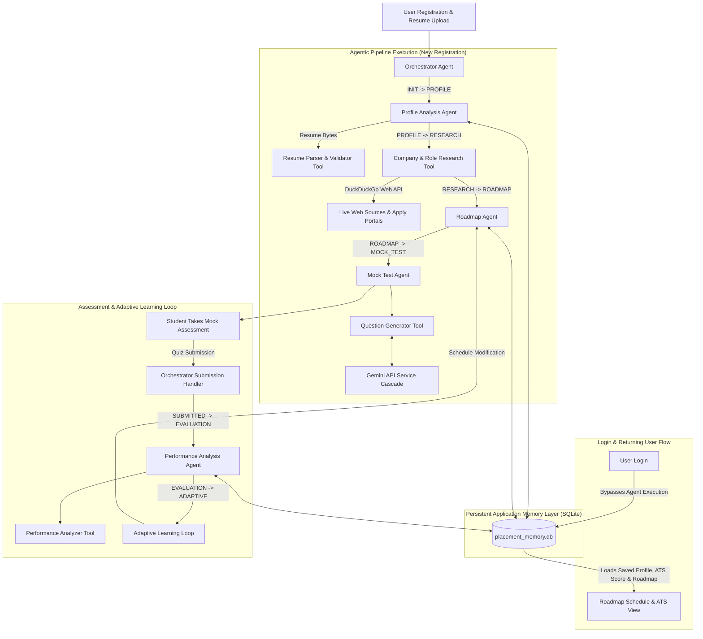

# AGENTIC AI PLACEMENT PREPARATION, RESUME ATS VALIDATION & OBSERVABILITY SYSTEM

[](https://github.com/Karuppasamy654/ioc_placement)
[](https://fastapi.tiangolo.com)
[](https://react.dev)
[](https://sqlite.org)
[](https://ai.google.dev)

---

## SECTION 1: Executive Summary & Project Overview

The **Agentic AI Placement Preparation System** is an enterprise-grade multi-agent software engineering platform designed to deliver personalized, adaptive, and observable campus placement preparation.

Traditional placement preparation platforms rely on static roadmaps, pre-fabricated generic question banks, and uncoordinated chatbots. In contrast, this project implements a **closed-loop multi-agent architecture** driven by Google Gemini LLM reasoning, specialized external deterministic tools, real-time web research, structured terminal logging, and a **persistent SQLite application memory layer**.

### Core Objectives
1. **Candidate Authentication & Resume Validation**: Secure user registration and login in SQLite with strict verification of resume file formats (`.pdf`/`.docx`), readable text length ($\ge 100$ chars), and fuzzy candidate name matching.
2. **ATS Resume Match Scoring & Actionable Fixes**: Calculates a $0-100\%$ ATS compatibility score against target role standards, highlighting missing role skills and specific resume layout modifications.
3. **Autonomous Market Research & Curated Links**: Scrapes real-time hiring criteria and provides direct official application URLs (e.g. `careers.google.com`) and verified technical study resources (LeetCode, GeeksforGeeks, MDN, System Design Primer).
4. **Tailored Study Roadmaps & Calendar View**: Generates custom multi-day schedules with a **Calendar View grid tab** and 1-click **iCalendar (`.ics`) file export**.
5. **Dynamic 50–60 MCQ Placement Assessments**: Constructs non-prewritten, candidate-tailored technical assessments evaluated with 4-option precision.
6. **Closed-Loop Adaptive Learning**: Automatically modifies upcoming study schedules based on deterministic test performance metrics.
7. **Persistent Cross-Session Memory**: Stores candidate preparation history in SQLite so that returning users load saved profiles/roadmaps instantly upon login without re-running agent execution.
8. **Rich Terminal Observability**: Outputs clean, structured, human-readable terminal banners, agent activity logs, tool execution timers, and Gemini API request/response metrics.

---

## SECTION 2: How to Run & View Terminal Execution Live

### Step 1: Open Terminal & Start Backend Server

Open your terminal window (PowerShell / Command Prompt) and run:

```powershell
cd D:\Documents\IOC_PROJECT
python -m uvicorn backend.main:app --reload --port 8000
```

### Step 2: Open Second Terminal & Start Frontend

In a second terminal window, start the React Vite UI:

```powershell
cd D:\Documents\IOC_PROJECT\frontend
npm run dev
```

### Step 3: Trigger Workflow & Watch Live Terminal Output

1. Open your browser at **`http://localhost:5173`** (or `http://localhost:8000`).
2. Click **Login / Register** in the top right.
3. Select **Register**, fill in candidate details, upload your PDF/Word resume, and click **Complete Registration**.
4. **Look at your 1st Terminal window!** You will see the complete multi-agent workflow streaming live in real time:

```text
============================================================
[PIPELINE] AGENTIC AI PLACEMENT PREPARATION PIPELINE
   Candidate: Alice Smith | Role: Backend Engineer @ Google | Session: 8f3a921d
============================================================

[STATE TRANSITION] INIT -> PROFILE_ANALYSIS

------------------------------------------------------------
[👤] PROFILE ANALYSIS AGENT
------------------------------------------------------------
[AGENT START] Profile Analysis Agent
🧠 MEMORY SYSTEM
[READ] Querying persistent memory DB for prior sessions of student 'Alice Smith'...
[MEMORY COMPLETE]

[AGENT ACTION] Sending candidate profile & resume to Gemini for ATS compatibility scoring...
[GEMINI REQUEST] Model: gemini-3.6-flash | Purpose: Profile ATS Score & Gap Analysis for Alice Smith
[GEMINI RESPONSE] Status: SUCCESS (HTTP 200) | Duration: 4.82s

🧠 MEMORY SYSTEM
[WRITE] Saved student profile for 'Alice Smith' with ATS Score 78.0% to SQLite database.
[AGENT RESULT] Profile analysis complete. ATS Match Score: 78.0%.

[STATE TRANSITION] PROFILE_ANALYSIS -> COMPANY_RESEARCH

------------------------------------------------------------
[🔍] COMPANY & ROLE RESEARCH TOOL
------------------------------------------------------------
[TOOL START] Company Research Tool
[TOOL PROCESS] Executing web search query: 'Google Backend Engineer interview process placement skills'
[TOOL RESULT] Retrieved hiring criteria with live web sources.

[STATE TRANSITION] COMPANY_RESEARCH -> ROADMAP_GENERATION

------------------------------------------------------------
[🗺️] DYNAMIC ROADMAP AGENT
------------------------------------------------------------
[AGENT START] Roadmap Agent
[GEMINI REQUEST] Model: gemini-3.5-flash-lite | Purpose: 14-Day Roadmap Schedule
🧠 MEMORY SYSTEM
[WRITE] Saved 14-day roadmap for candidate 'Alice Smith' to SQLite database.

[STATE TRANSITION] ROADMAP_GENERATION -> MOCK_TEST_GENERATION

------------------------------------------------------------
[📝] DYNAMIC MOCK TEST AGENT
------------------------------------------------------------
[AGENT START] Mock Test Agent
[TOOL START] Question Generator Tool
[TOOL PROCESS] Querying Gemini API in structured batches for 55 dynamic MCQs...
[TOOL RESULT] 55 valid dynamic MCQs generated and validated (4 options per question).

============================================================
[PIPELINE] WORKFLOW COMPLETED SUCCESSFULLY IN 52.41S
   Generated 14 Roadmap Days & 55 MCQs | Session: 8f3a921d
============================================================
```

---

## SECTION 3: System Architecture & Mermaid Diagrams

The application operates as a directed acyclic state graph (DAG) governed by an **Orchestrator Agent**, coordinating autonomous agents, deterministic tools, and a persistent SQLite database.



---

## SECTION 4: Multi-Agent System Roles & State Graph

| Agent Name | Core Responsibilities | Inputs | Primary Outputs | State Transition |
| :--- | :--- | :--- | :--- | :--- |
| **Orchestrator Agent** | Pipeline execution control, session state management, terminal banners, event logging, execution timing. | `StudentInput`, Resume File | `SessionState` | `INIT ➔ COMPLETED` |
| **Profile Analysis Agent** | Resume ATS compatibility scoring ($0-100\%$), skill extraction, candidate capability mapping, skill gap analysis. | `StudentInput`, `ResumeData`, SQLite History | `StudentProfile` | `PROFILE_ANALYSIS` |
| **Roadmap Agent** | Multi-day study schedule generation, daily hour balancing, priority allocation for past/present weak topics. | `StudentProfile`, `CompanyResearch`, SQLite History | `Roadmap` | `ROADMAP_GENERATION` |
| **Mock Test Agent** | Coordinates 50-60 dynamic MCQ generation, balances core CS vs role-specific questions. | `StudentProfile`, `CompanyResearch`, `Roadmap` | `MockTest` | `MOCK_TEST_GENERATION` |
| **Performance Analysis Agent** | Deterministic score evaluation, topic accuracy mapping, memory write, adaptive schedule reinforcement. | `MockTest`, `QuizSubmission`, `Roadmap` | `PerformanceReport`, `AdaptiveAdjustment` | `PERFORMANCE_EVALUATION` |

---

## SECTION 5: Autonomous Tool Ecosystem

1. **Resume Parser & Validator Tool (`backend/tools/resume_parser.py`)**
   - **Function**: Validates file extension (`.pdf`/`.docx`), verifies text length ($\ge 100$ chars), and matches candidate name tokens. Categorizes programming languages, frameworks, databases, and projects.
   - **Terminal Output**: Logs input file size, extraction duration, character count, and itemized skill counts.

2. **Company Research Tool (`backend/tools/company_research.py`)**
   - **Function**: Performs live web search to gather company hiring criteria, key tech stacks, official application portals (e.g. `careers.google.com`), and verified technical study links (LeetCode, GeeksforGeeks, MDN, System Design Primer).

3. **Question Generator Tool (`backend/tools/question_generator.py`)**
   - **Function**: Queries Gemini API in structured batches to produce 50–60 dynamic MCQs (4 options per question, single correct answer, technical explanations).

4. **Performance Analyzer Tool (`backend/tools/performance_analyzer.py`)**
   - **Function**: Pure Python deterministic scoring engine. Computes total questions, correct/incorrect counts, percentage score, topic-wise accuracy %, and difficulty breakdown.

5. **iCalendar (.ics) Exporter (`backend/utils/ics_exporter.py`)**
   - **Function**: Generates RFC 5545 compliant `.ics` calendar files mapping preparation roadmap days to consecutive dates starting from today.

---

## SECTION 6: Persistent Memory Architecture (SQLite)

The persistent application memory is managed by SQLite (`backend/memory/placement_memory.db`), supporting 6 relational tables:

```sql
-- 1. Candidate User Accounts
CREATE TABLE IF NOT EXISTS users (
    id INTEGER PRIMARY KEY AUTOINCREMENT,
    username TEXT UNIQUE NOT NULL,
    email TEXT UNIQUE NOT NULL,
    password_hash TEXT NOT NULL,
    name TEXT NOT NULL,
    target_company TEXT,
    target_role TEXT,
    prep_days INTEGER DEFAULT 14,
    daily_hours REAL DEFAULT 4.0,
    current_skills TEXT DEFAULT '',
    created_at TIMESTAMP DEFAULT CURRENT_TIMESTAMP
);

-- 2. Candidate Profiles Table
CREATE TABLE IF NOT EXISTS student_profiles (
    id INTEGER PRIMARY KEY AUTOINCREMENT,
    name TEXT UNIQUE NOT NULL,
    target_company TEXT,
    target_role TEXT,
    prep_days INTEGER,
    daily_hours REAL,
    user_skills TEXT,
    strong_areas TEXT,
    weak_areas TEXT,
    resume_gaps TEXT,
    ats_score REAL DEFAULT 75.0,
    resume_score_json TEXT,
    created_at TIMESTAMP DEFAULT CURRENT_TIMESTAMP,
    updated_at TIMESTAMP DEFAULT CURRENT_TIMESTAMP
);

-- 3. Mock Test Attempts Table
CREATE TABLE IF NOT EXISTS mock_attempts (
    id INTEGER PRIMARY KEY AUTOINCREMENT,
    session_id TEXT NOT NULL,
    student_name TEXT NOT NULL,
    total_questions INTEGER,
    answered_questions INTEGER,
    correct_count INTEGER,
    incorrect_count INTEGER,
    score_percentage REAL,
    topic_accuracy_json TEXT,
    difficulty_accuracy_json TEXT,
    strong_topics_json TEXT,
    weak_topics_json TEXT,
    created_at TIMESTAMP DEFAULT CURRENT_TIMESTAMP,
    FOREIGN KEY(student_name) REFERENCES student_profiles(name)
);

-- 4. Generated Roadmaps Table
CREATE TABLE IF NOT EXISTS roadmaps (
    id INTEGER PRIMARY KEY AUTOINCREMENT,
    session_id TEXT UNIQUE NOT NULL,
    student_name TEXT NOT NULL,
    total_days INTEGER,
    daily_hours REAL,
    overview TEXT,
    days_json TEXT,
    created_at TIMESTAMP DEFAULT CURRENT_TIMESTAMP
);

-- 5. Adaptive Adjustments Table
CREATE TABLE IF NOT EXISTS adaptive_adjustments (
    id INTEGER PRIMARY KEY AUTOINCREMENT,
    session_id TEXT NOT NULL,
    student_name TEXT NOT NULL,
    weak_topics_addressed_json TEXT,
    concepts_to_revise_json TEXT,
    schedule_changes_json TEXT,
    created_at TIMESTAMP DEFAULT CURRENT_TIMESTAMP
);
```

---

## SECTION 7: Execution Workflows: New Registration vs Returning Login

### Workflow 1: New Candidate Registration
1. User clicks **Login / Register** -> **Register**.
2. Uploads resume, inputs target role/company, and submits.
3. System validates format, readable length, and candidate name match.
4. User account is saved to SQLite `users` table.
5. System launches multi-agent pipeline in background and opens **Agent Execution** (`activity`) tab to display live streaming logs.

### Workflow 2: Existing User Login
1. User clicks **Login / Register** -> **Login**.
2. Inputs registered username and password.
3. System authenticates credentials and retrieves saved history from SQLite database.
4. **System bypasses Agent Execution** and immediately opens the personalized **Roadmap Schedule** (`roadmap`) tab with all saved ATS scores and study days loaded.

---

## SECTION 8: Automated Test Suites

Run automated test scripts directly from terminal:

```bash
# Test 1: Full multi-agent preparation pipeline & adaptive assessment
python backend/tests/test_pipeline.py

# Test 2: Cross-session persistent memory recall (Session 1 vs Session 2)
python backend/tests/test_memory_and_observability.py

# Test 3: Resume validation, name matching, ATS scoring, user auth, and calendar export
python backend/tests/test_auth_and_resume_validation.py
```

---

## SECTION 9: Defense Questions & Expert Answers (Academic Viva Q&A)

### Q1: How does your system differ from a standard ChatGPT prompt wrapper?
**Answer**: ChatGPT wrappers are stateless single-turn interfaces. Our system is an autonomous multi-agent architecture with a shared mutable state graph, 5 specialized deterministic tools, live web research capability, and a persistent SQLite memory database that remembers candidate performance across sessions.

### Q2: How do you validate resumes and prevent candidate name impersonation?
**Answer**: The `ResumeParserTool.validate_resume` method verifies that uploaded files are text-readable `.pdf` or `.docx` documents (minimum 100 characters). It splits the registered student name into name tokens and performs fuzzy token matching against the extracted resume text. If the name is missing or the file is unreadable, an explicit validation alert is returned.

### Q3: Why is SQLite used for the persistent memory system?
**Answer**: SQLite provides a zero-configuration, serverless, file-based relational database (`placement_memory.db`) embedded directly in Python standard library (`sqlite3`). It allows instant persistence across runs without requiring external database server installation.

### Q4: How is deterministic accuracy calculated?
**Answer**: Test scoring is completely decoupled from LLMs. The `PerformanceAnalyzerTool` performs pure Python mathematical matching between student option selections and validated answer keys, computing exact floating-point percentages and topic accuracy ratios.

---

## SECTION 10: System Directory Structure

```text
IOC_PROJECT/
├── backend/
│   ├── main.py                     # FastAPI application & API route handlers
│   ├── agents/
│   │   ├── orchestrator.py         # Workflow orchestration agent
│   │   ├── profile_agent.py        # Candidate profiling & ATS scoring agent
│   │   ├── roadmap_agent.py        # Schedule generation agent
│   │   ├── mock_test_agent.py      # Quiz coordination agent
│   │   └── performance_agent.py    # Performance evaluation & adaptation agent
│   ├── memory/
│   │   ├── db.py                   # SQLite DB connection & schema manager
│   │   ├── memory_manager.py       # Persistence methods for users, profiles, roadmaps
│   │   └── placement_memory.db     # Active SQLite database file
│   ├── tools/
│   │   ├── resume_parser.py        # PyMuPDF & python-docx parser & validator
│   │   ├── company_research.py     # Live web research & official portal links
│   │   ├── question_generator.py   # Gemini dynamic MCQ generator
│   │   └── performance_analyzer.py # Deterministic scoring engine
│   ├── utils/
│   │   ├── ics_exporter.py         # iCalendar (.ics) export generator
│   │   └── logger.py               # Structured terminal logging framework
│   ├── services/
│   │   └── gemini_service.py       # Centralized LLM client & model cascade
│   ├── models/
│   │   ├── schemas.py              # Pydantic data schemas
│   │   └── state.py                # Session state manager
│   └── tests/
│       ├── test_pipeline.py
│       ├── test_memory_and_observability.py
│       └── test_auth_and_resume_validation.py
├── frontend/
│   ├── src/
│   │   ├── components/
│   │   │   ├── AgentActivity.jsx   # Terminal log execution viewer
│   │   │   ├── AuthModal.jsx       # Registration & Login modal
│   │   │   ├── Roadmap.jsx        # Roadmap timeline & Calendar View grid
│   │   │   ├── ResumeGap.jsx      # ATS Resume Score & Fixes section
│   │   │   ├── MockTest.jsx       # Timed assessment interface
│   │   │   ├── Results.jsx        # Performance metrics & adaptive breakdown
│   │   │   └── Sources.jsx        # Official careers & curated study resources
│   │   ├── App.jsx                 # Core UI container
│   │   └── api.js                  # Axios HTTP bridge
│   ├── package.json
│   └── vite.config.js
├── README.md                       # Comprehensive documentation
└── requirements.txt                # Python dependencies
```
